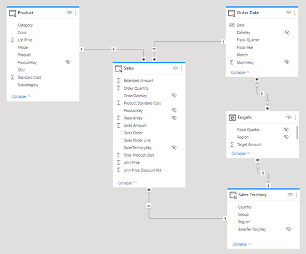
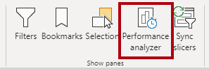
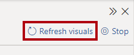
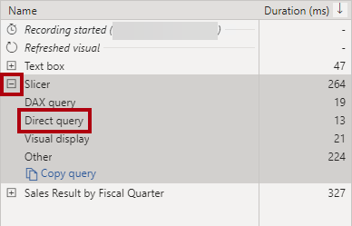
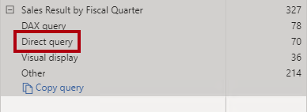
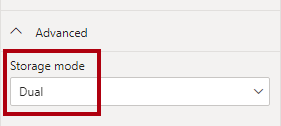
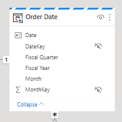
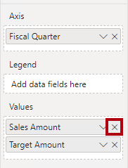
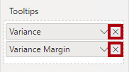

---
lab:
    title: 'Improve query performance with dual storage mode'
    module: 'Optimize enterprise-scale tabular models'
---

# Improve query performance with dual storage mode

## Overview

**The estimated time to complete the lab is 30 minutes**

In this lab, you will improve the performance of a composite model by setting some tables to use dual storage mode.

In this lab, you learn how to:

- Set dual storage mode.

- Use Performance analyzer to review refresh activities.

## Get started

In this exercise, you will prepare your environment.

### Clone the repository for this course

1. On the start menu, open the Command Prompt

    

1. In the command prompt window, navigate to the D drive by typing:

    `d:` 

   Press enter.

    

1. In the command prompt window, enter the following command to download the course files and save them to a folder called DP500.
    
	`git clone https://github.com/MicrosoftLearning/DP-500-Azure-Data-Analyst DP500`
   
1. When the repository has been cloned, close the command prompt window. 
   
1. Open the D drive in the file explorer to ensure the files have been downloaded.

### Set up Power BI Desktop

In this task, you will open a pre-developed Power BI Desktop solution.

1. To open File Explorer, on the taskbar, select the **File Explorer** shortcut.

	

2. Go to the **D:\DP500\Allfiles\11\Starter** folder.

3. To open a pre-developed Power BI Desktop file, double-click the **Sales Analysis - Improve query performance with dual storage mode.pbix** file.

4. If prompted about a potential security risk, read the message, and then select **OK**.

	

5. If prompted to approve running a Native Database Query, select **Run**.

6. To save the file, on the **File** ribbon tab, select **Save as**.

7. In the **Save As** window, go to the **D:\DP500\Allfiles\11\MySolution** folder.

8. Select **Save**.

### Review the report

In this task, you will review the pre-developed report.

1. In Power BI Desktop, at the bottom right corner in the status bar, notice that the storage mode is Mixed.

	

	*A mixed model comprises tables from different source groups. This model has one import table that sources its data from an Excel workbook. The remaining tables use a DirectQuery connection to a SQL Server database, which is the data warehouse.*

2. Review the report design.

	

	*This report page has a title and two visuals. The slicer visual allows filtering by a single fiscal year, while the column chart visual displays quarterly sales and target amounts. You will improve the performance of the report by setting some tables to use dual storage mode.*

### Review the data model

In this task, you will review the pre-developed data model.

1. Switch to **Model** view.

	

2. Use the model diagram to review the model design.

	

	*The model comprises three dimension tables and two fact tables. The **Sales** fact table represents sales order details, while the **Targets** table represents quarterly sales targets. It's a classic star schema design. The bar across the top of some of the tables indicate they use DirectQuery storage mode. Every table that has a blue bar belongs to the same source group.*

	*In this lab, you will set up some tables to use dual storage mode.*

## Set up dual storage mode

In this exercise, you will set up dual storage mode.

*A model table that uses dual storage mode uses both import and DirectQuery storage mode at the same time. Power BI determines the most efficient storage mode to use on a query by query basis, striving to use import mode whenever possible because it's faster.*

### Use Performance analyzer

In this task, you will open Performance analyzer and use it to inspect refresh events.

1. Switch to **Report** view.

	

2. To inspect visual refresh events, on the **View** ribbon tab, from inside the **Show** panes group, select **Performance analyzer**.

	

3. In the **Performance analyzer** pane (located to the left of the **Visualizations** pane), select **Start recording**.

	

	*Performance analyzer inspects and displays the duration necessary to update or refresh the visuals. Each visual issues at least one query to the source database. For more information, see [Use Performance Analyzer to examine report element performance](https://docs.microsoft.com/power-bi/create-reports/desktop-performance-analyzer).*

4. Select **Refresh visuals**.

	

5. In the **Performance analyzer** pane, expand open the **Slicer** visual, and notice the direct query event.

	

	*Whenever you see a direct query event, it tells you that Power BI used DirectQuery storage mode to retrieve the data from the source database.*

6. Expand open the **Sales Result by Fiscal Quarter** visual, and notice that it recorded a direct query event also.

	

	*You always set up a slicer visual by using one or more fields from the same table. It isn't possible to use fields from different tables to set up a slicer. What's more, a slicer almost always uses fields from a dimension table. So, to improve query performance of slicer visuals, ensure they store imported data. In this case, because the dimension tables use DirectQuery storage mode, you can set them to dual storage mode. Because dimension tables store few rows (relative to fact tables), it shouldn't result in an excessively large model cache.*

### Set up dual storage mode

In this task, you will set all dimension tables to use dual storage mode.

1. Switch to **Model** view.

2. Select the header of the **Product** table.

3. While pressing the **Ctrl** key, select the headers of the **Order Date** and **Sales Territory** tables also.

4. In the **Properties** pane, expand open the **Advanced** section.

	

5. In the **Storage mode** dropdown list, select **Dual**.

	

6. When prompted to confirm the update, select **OK**.

	

	*The warning informs you that it might take considerable time for Power BI Desktop to import data into the model tables.*

7. In the model diagram, notice the striped bar across the top of each dimension table.

	

	*A striped bar indicates dual storage mode.*

### Review the report

In this task, you will review the pre-developed report.

1. Switch to **Report** view.

	

2. In the **Performance analyzer** pane, select **Clear**.

	

3. Refresh the visuals.

	

4. Notice that the slicer visual no longer uses a direct query connection.

	*Power BI queries the model cache of imported data, so the slicer now refreshes more quickly.*

5. Notice, however, that the column chart visual still uses a direct query connection.

	*That's because the **Sales Amount** field is a column of the **Sales** table, which uses DirectQuery store mode.*

6. Select the column chart visuals, and then in the **Visualizations** pane, from inside the **Values** well, remove the **Sales Amount** field.

	

7. Also remove the two fields from the **Tooltips** well.

	

	*Both of these measures depend on the **Sales Amount** column.*

8. In the **Performance analyzer** pane, expand open the last refresh event, and notice that the column chart visual no longer uses a direct query connection.

	*That's because the column chart visual now only uses two tables, both of which are cached in the model. The **Order Date** table uses dual storage mode, while the **Targets** table uses import storage mode.*

	*You have now improved the performance of specific queries where Power BI can retrieve data from the model cache. The key takeaway is that dimension tables that relate to DirectQuery fact tables should usually be set to dual storage mode. That way, when queried by a slicer, the queries will be quick.*

	*You could further optimize the model to improve query performance by adding aggregations. However, that enhancement will be the learning objective of a different lab.*

### Finish up

In this task, you will finish up.

1. Save the Power BI Desktop file.

	

2. Close Power BI Desktop.
