---
lab:
    title: 'Improve query performance with aggregations'
    module: 'Optimize enterprise-scale tabular models'
---

# Improve query performance with aggregations

## Overview

**The estimated time to complete the lab is 30 minutes**

In this lab, you will add an aggregation to improve the query performance of the **Sales** fact table.

In this lab, you learn how to:

- Set up an aggregation.

- Use Performance analyzer to determine whether Power BI uses an aggregation.

## Get started

In this exercise, you will prepare your environment.

### Clone the repository for this course

1. On the start menu, open the Command Prompt

    

1. In the command prompt window, navigate to the D drive by typing:

    `d:` 

   Press enter.

    

1. In the command prompt window, enter the following command to download the course files and save them to a folder called DP500.
    
	`git clone https://github.com/MicrosoftLearning/DP-500-Azure-Data-Analyst DP500`
   
1. When the repository has been cloned, close the command prompt window. 
   
1. Open the D drive in the file explorer to ensure the files have been downloaded.

### Set up Power BI Desktop

In this task, you will open a pre-developed Power BI Desktop solution.

1. To open File Explorer, on the taskbar, select the **File Explorer** shortcut.

	

2. Go to the **D:\DP500\Allfiles\12\Starter** folder.

3. To open a pre-developed Power BI Desktop file, double-click the **Sales Analysis - Improve query performance with aggregations.pbix** file.

    *If you receive a Potential security risk warning, **select OK***.
    
    *If prompted to approve running a Native Database Query, **select Run**.

4. To save the file, on the **File** ribbon tab, select **Save as**.

5. In the **Save As** window, go to the **D:\DP500\Allfiles\12\MySolution** folder.

6. Select **Save**.

### Review the report

In this task, you will review the pre-developed report.

1. In Power BI Desktop, at the bottom right corner in the status bar, notice that the storage mode is **Mixed**.

	

	*A mixed mode model comprises tables from different source groups. This model has one import table that sources its data from an Excel workbook. The remaining tables use a DirectQuery connection to a SQL Server database, which is the data warehouse.*

2. Review the report design.

	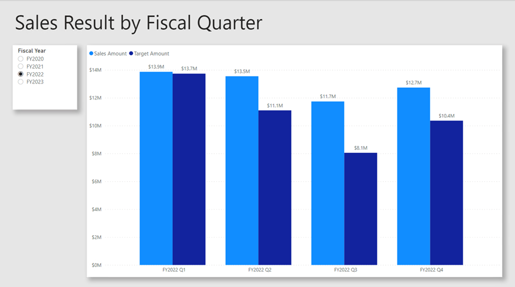

	*This report page has a title and two visuals. The slicer visual allows filtering by a single fiscal year, while the column chart visual displays quarterly sales and target amounts. In this lab, you will improve the performance of the report by adding an aggregation.*

### Review the data model

In this task, you will review the pre-developed data model.

1. Switch to **Model** view.

	

2. Use the model diagram to review the model design.

	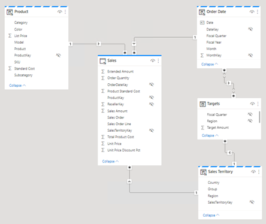

	*The model comprises three dimension tables and two fact tables. The **Sales** fact table represents sales order details, while the **Targets** table represents quarterly sales targets. It's a classic star schema design. The bar across the top of some of the tables indicate they use DirectQuery storage mode. Every table that has a blue bar belongs to the same source group.*

	*The three dimension tables have a striped bar, which indicates they use dual storage mode. That means the tables use both import and DirectQuery storage mode. Power BI determines the most efficient storage mode to use on a query by query basis, striving to use import mode whenever possible because it's faster.*

	*In this lab, you will add an aggregation to improve the performance of specific **Sales** table queries.*

### Use Performance analyzer

In this task, you will open Performance analyzer and use it to inspect refresh events.

1. Switch to **Report** view.

	

2. To inspect visual refresh events, on the **View** ribbon tab, from inside the **Show** panes group, select **Performance analyzer**.

	

3. In the **Performance analyzer** pane (located to the left of the **Visualizations** pane), select **Start recording**.

	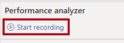

	*Performance analyzer inspects and displays the duration necessary to update or refresh the visuals. Each visual issues at least one query to the source database. For more information, see [Use Performance Analyzer to examine report element performance](https://docs.microsoft.com/power-bi/create-reports/desktop-performance-analyzer).*

4. Select **Refresh visuals**.

	

5. In the **Performance analyzer** pane, expand open the **Sales Result by Fiscal Quarter** visual, and notice the direct query event.

6. Take note of the total duration in milliseconds so you can use it as a baseline for comparison later in this lab.

	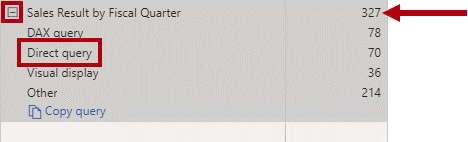

	*Whenever you see a direct query event, it tells you that Power BI used DirectQuery storage mode to retrieve the data from the source database.*

	*A common reason why a data warehouse fact table uses DirectQuery mode is because of its large data volumes. It isn't possible or economically practical to import such a large volume of data. However, the data model can cache an aggregated view of the fact table that can help improve the performance of specific, typically high-level, queries.*

	*In this lab, you will add an aggregation of the **Sales** table data to specifically improve the performance for visual refreshes that query the sum of the **Sales Amount** column by date and sales territory.*

## Set up an aggregation

In this exercise, you will set up an aggregation.

*Aggregations in Power BI can improve query performance over exceptionally large DirectQuery tables. By using aggregations, the data model caches data at an aggregated level in-memory. Power BI automatically uses the aggregation whenever it can.*

### Add an aggregation table

In this task, you will add an aggregation table to model.

1. To open the Power Query Editor window, on the **Home** ribbon tab, from inside the **Queries** group, click the **Transform data** icon.

	

2. In the Power Query Editor window, from inside the **Queries** pane, right-click the **Sales** query, and then select **Duplicate**.

	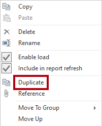

3. In the **Queries** pane, notice the addition of a new query.

	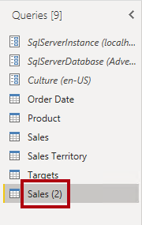

	*You will apply a transformation to group by the **OrderDateKey** and **SalesTerritoryKey** columns, and aggregate the sum of **Sales Amount** column.*

4. In the **Query Settings** pane (located at the right), in the **Name** box, replace the text with **Sales Agg**.

	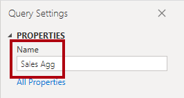

5. On the **Transform** ribbon tab, from inside the **Table** group, select **Group By**.

	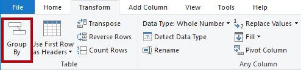

6. In the **Group By** window, select the **Advanced** option.

	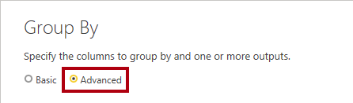

	*The advanced option allows grouping by more than one column.*

7. In the grouping dropdown list, select **OrderDateKey**.

	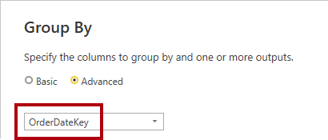

8. Select **Add grouping**.

	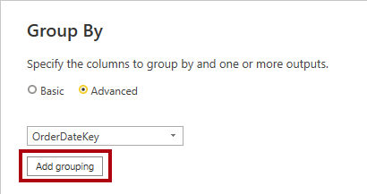

9. In the second grouping dropdown list, select **SalesTerritoryKey**.

	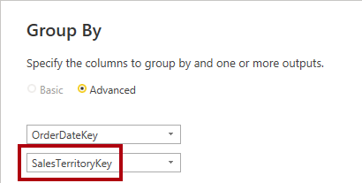

10. In the **New column name** box, replace the text with **Sales Amount**.

11. In the **Operation** dropdown list, select **Sum**.

12. In the **Column** dropdown list, select **Sales Amount**.

	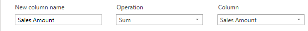

13. Select **OK**.

	

14. On the **Home** ribbon tab, from inside the **Close** group, click the **Close &amp; Apply** icon.

	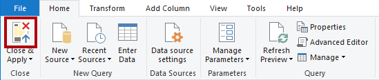

	*Power BI Desktop adds a new table to the model.*

15. Save the Power BI Desktop file.

	

### Set model properties

In this task, you will set model properties for the new table.

1. Switch to **Model** view.

	

2. In the model diagram, position the new table so that it is to the right of the **Targets** table.

	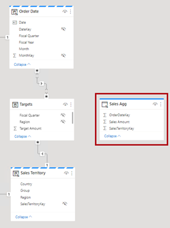

3. Notice that the **Sales Agg** table has a blue bar across the top, indicating that is uses DirectQuery storage mode.

	*While it's possible for aggregations to use DirectQuery storage mode, in these cases they should connect to a materialized view in the data source. In this lab, the aggregation will use import storage mode.*

4. Select the **Sales Agg** table.

5. In the **Properties** pane, expand open the **Advanced** section.

	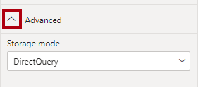

6. In the **Storage mode** dropdown list, select **Import**.

	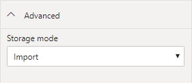

7. When prompted to confirm the update, select **OK**.

	

	*The warning informs you that it might take considerable time for Power BI Desktop to import data into the model tables. It also informs you that it's an irreversible action. It's not possible to change an import storage mode table back to a DirectQuery storage mode table (unless you restore from an earlier version of the Power BI Desktop file).*

8. Notice that Power BI Desktop loaded 6,806 rows of data into the new table.

	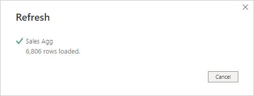

	*These rows represent each order date and sales region combination. It's a very small amount of data that has summarized a potentially very large volume of fact table rows.*

9. In the **Sales Agg** table, select the **Sales Amount** column.

10. In the **Properties** pane, in the **Formatting** section, in the **Data type** dropdown list, select **Fixed decimal number**.

	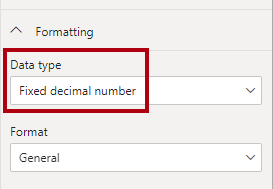

	*To manage the aggregation (later in this exercise), the data type must match that of the **Sales Amount** column in the **Sales** table.*

11. When prompted to confirm the update, select **OK**.

	

### Create model relationships

In this task, you will create two model relationships.

1. To create a relationship, from the **Order Date** table, drag the **DateKey** column and drop it on to the **OrderDateKey** column of the **Sales Agg** table.

	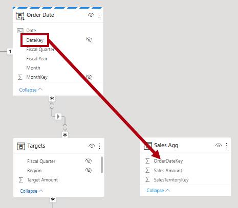

2. In the **Create relationship** window, notice that the **Cardinality** dropdown list is set to **One to many**.

	*The **DateKey** column in the **Order Date** table contains unique values, while the **OrderDateKey** column in the **Sales Agg** table contains duplicate values. This one-to-many cardinality is common for relationships between dimension and aggregations based on fact tables.*

3. Select **OK**.

	

4. In the model diagram, notice that a relationship now exists between the **Order Date** and **Sales Agg** tables.

5. Create another relationship, this time relating the **SalesTerritoryKey** column of the **Sales Territory** table to the **SalesTerritoryKey** column of the **Sales Agg** table.

	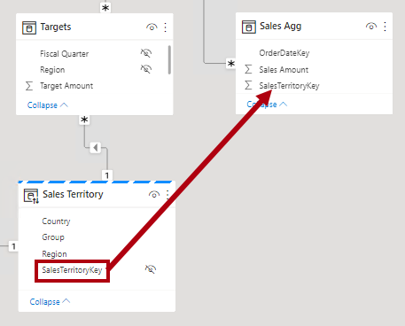

6. In the **Create relationship** window, select **OK**.

	

	*The tasks you completed in this lab have added an import table to the model, and related it to other model tables. However, it's not yet an aggregation that Power BI can transparently use to improve query performance. You will set up the aggregation in the next task.*

7. Review the model diagram, and notice that the **Sales Agg** table is now related to two dimension tables.

	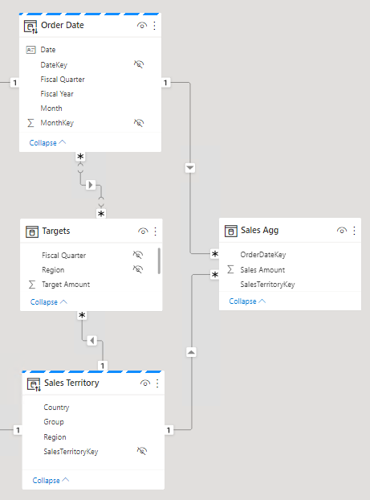

### Set up an aggregation

In this task, you will setup an aggregation.

1. In the model diagram, right-click the **Sales Agg** table header, and then select **Manage aggregations**.

	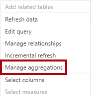

2. In the **Manage aggregations** window, for the **OrderDateKey** column, set the following properties:

	- Summarization: **GroupBy**

	- Detail table: **Sales**

	- Detail column: **OrderDateKey**

	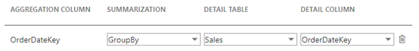

3. For the **Sales Amount** column, set the following properties:

	- Summarization: **Sum**

	- Detail table: **Sales**

	- Detail column: **Sales Amount**

4. For the **SalesTerritoryKey** column, set the following properties:

	- Summarization: **GroupBy**

	- Detail table: **Sales**

	- Detail column: **SalesTerritoryKey**

5. Verify that the aggregation set up looks like the following:

	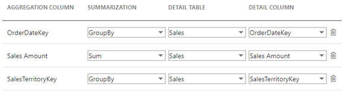

6. Notice the warning that describes that Power BI will hide the table.

	

	*Power BI Desktop will hide the table in a way that's different to other hidden model objects. Power BI will always hide aggregations, and not even model calculations can ever reference them.*

7. Select **Apply all**.

	

8. In the model diagram, notice that the **Sales Agg** table is a hidden table.

	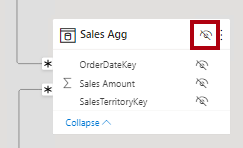

	*Now, whenever a visual queries the **Sales** table for the sum of the **Sales Amount** column, grouping by any column of the **Order Date** or **Sales Territory** tables, Power BI will use the aggregation instead.*

### Test the aggregation

In this task, you will test the aggregation and determine whether Power BI uses it.

1. Switch to **Report** view.

	

2. In the **Performance analyzer** pane, select **Refresh visuals**.

	

3. Expand open the **Sales Result by Fiscal Quarter** visual, and notice that it no longer has a direct query event.

4. Compare the duration with the baseline you noted earlier in this lab.

	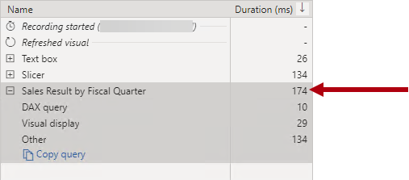

	*What happens when users filter the column chart visual by other tables?*

5. To clone the **Fiscal Year** slicer, first select the slicer.

6. On the **Home** ribbon tab, from inside the **Clipboard** group, select **Copy**.

	

7. On the **Home** ribbon tab, from inside the **Clipboard** group, select **Paste**.

	

8. Position the new slicer directly beneath the original slicer.

	

9. Select the new slicer, and then in the **Visualizations** pane, in the **Field** well, remove the **Fiscal Year** field.

	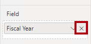

10. From the **Fields** pane, expand open the **Sales Territory** table, and then drag the **Group** field into the **Field** well.

	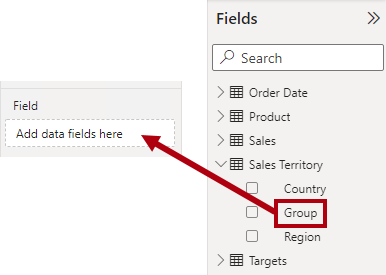

11. In the **Group** slicer, select any group (except blank).

	

	*Does Power BI use the aggregation?*

	*The answer is yes because the aggregation groups by the **SalesTerritoryKey** column. That column relates to the **Sales Territory** table. So, you can use any column of the **Sales Territory** table to filter the column chart visual and it will use the aggregation.*

12. Clone the **Group** slicer to create a slicer based on the **Category** field of the **Product** table.

	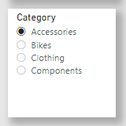

	*Does Power BI use the aggregation?*

	*The answer is no because the aggregation doesn't group by the **ProductKey** column (or any other column of the **Product** table). In this case, Power BI must use a DirectQuery connection to refresh the visual.*

	*You have now improved the performance of specific queries by allowing Power BI to retrieve data from the model cache. The key takeaway is that aggregations can accelerate the performance of fact table queries, especially for specific measure and high-level groupings. Also, dual storage mode and aggregations work well together, providing opportunities for Power BI to avoid using expensive DirectQuery connections to source data.*

### Finish up

In this task, you will finish up.

1. Save the Power BI Desktop file.

	

2. Close Power BI Desktop.
